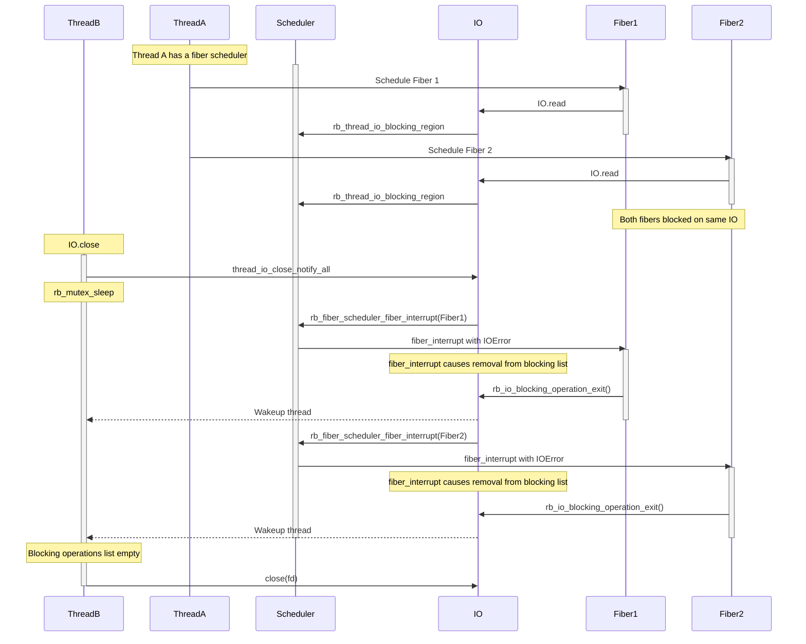

# Fiber

Fibers provide a mechanism for cooperative concurrency.

## Context Switching

Fibers execute a user-provided block. During the execution, the block may call `Fiber.yield` or `Fiber.transfer` to switch to another fiber. `Fiber#resume` is used to continue execution from the point where `Fiber.yield` was called.

```rb
#!/usr/bin/env ruby

puts "1: Start program."

f = Fiber.new do
  puts "3: Entered fiber."
  Fiber.yield
  puts "5: Resumed fiber."
end

puts "2: Resume fiber first time."
f.resume

puts "4: Resume fiber second time."
f.resume

puts "6: Finished."
```

This program demonstrates the flow control of fibers.

## Scheduler

The scheduler interface is used to intercept blocking operations. A typical
implementation would be a wrapper for a gem like `EventMachine` or `Async`. This
design provides separation of concerns between the event loop implementation
and application code. It also allows for layered schedulers which can perform
instrumentation.

To set the scheduler for the current thread:

```rb
Fiber.set_scheduler(MyScheduler.new)
```

When the thread exits, there is an implicit call to `set_scheduler`:

```rb
Fiber.set_scheduler(nil)
```

### Design

The scheduler interface is designed to be a un-opinionated light-weight layer
between user code and blocking operations. The scheduler hooks should avoid
translating or converting arguments or return values. Ideally, the exact same
arguments from the user code are provided directly to the scheduler hook with
no changes.

### Interface

This is the interface you need to implement.

```rb
class Scheduler
  # Wait for the specified process ID to exit.
  # This hook is optional.
  # @parameter pid [Integer] The process ID to wait for.
  # @parameter flags [Integer] A bit-mask of flags suitable for `Process::Status.wait`.
  # @returns [Process::Status] A process status instance.
  def process_wait(pid, flags)
    Thread.new do
      Process::Status.wait(pid, flags)
    end.value
  end

  # Wait for the given io readiness to match the specified events within
  # the specified timeout.
  # @parameter event [Integer] A bit mask of `IO::READABLE`,
  #   `IO::WRITABLE` and `IO::PRIORITY`.
  # @parameter timeout [Numeric] The amount of time to wait for the event in seconds.
  # @returns [Integer] The subset of events that are ready.
  def io_wait(io, events, timeout)
  end

  # Read from the given io into the specified buffer.
  # WARNING: Experimental hook! Do not use in production code!
  # @parameter io [IO] The io to read from.
  # @parameter buffer [IO::Buffer] The buffer to read into.
  # @parameter length [Integer] The minimum amount to read.
  def io_read(io, buffer, length)
  end

  # Write from the given buffer into the specified IO.
  # WARNING: Experimental hook! Do not use in production code!
  # @parameter io [IO] The io to write to.
  # @parameter buffer [IO::Buffer] The buffer to write from.
  # @parameter length [Integer] The minimum amount to write.
  def io_write(io, buffer, length)
  end

  # Sleep the current task for the specified duration, or forever if not
  # specified.
  # @parameter duration [Numeric] The amount of time to sleep in seconds.
  def kernel_sleep(duration = nil)
  end

  # Execute the given block. If the block execution exceeds the given timeout,
  # the specified exception `klass` will be raised. Typically, only non-blocking
  # methods which enter the scheduler will raise such exceptions.
  # @parameter duration [Integer] The amount of time to wait, after which an exception will be raised.
  # @parameter klass [Class] The exception class to raise.
  # @parameter *arguments [Array] The arguments to send to the constructor of the exception.
  # @yields {...} The user code to execute.
  def timeout_after(duration, klass, *arguments, &block)
  end

  # Resolve hostname to an array of IP addresses.
  # This hook is optional.
  # @parameter hostname [String] Example: "www.ruby-lang.org".
  # @returns [Array] An array of IPv4 and/or IPv6 address strings that the hostname resolves to.
  def address_resolve(hostname)
  end

  # Block the calling fiber.
  # @parameter blocker [Object] What we are waiting on, informational only.
  # @parameter timeout [Numeric | Nil] The amount of time to wait for in seconds.
  # @returns [Boolean] Whether the blocking operation was successful or not.
  def block(blocker, timeout = nil)
  end

  # Unblock the specified fiber.
  # @parameter blocker [Object] What we are waiting on, informational only.
  # @parameter fiber [Fiber] The fiber to unblock.
  # @reentrant Thread safe.
  def unblock(blocker, fiber)
  end

  # Intercept the creation of a non-blocking fiber.
  # @returns [Fiber]
  def fiber(&block)
    Fiber.new(blocking: false, &block)
  end

  # Invoked when the thread exits.
  def close
    self.run
  end

  def run
    # Implement event loop here.
  end
end
```

Additional hooks may be introduced in the future, we will use feature detection
in order to enable these hooks.

### Non-blocking Execution

The scheduler hooks will only be used in special non-blocking execution
contexts. Non-blocking execution contexts introduce non-determinism because the
execution of scheduler hooks may introduce context switching points into your
program.

#### Fibers

Fibers can be used to create non-blocking execution contexts.

```rb
Fiber.new do
  puts Fiber.current.blocking? # false

  # May invoke `Fiber.scheduler&.io_wait`.
  io.read(...)

  # May invoke `Fiber.scheduler&.io_wait`.
  io.write(...)

  # Will invoke `Fiber.scheduler&.kernel_sleep`.
  sleep(n)
end.resume
```

We also introduce a new method which simplifies the creation of these
non-blocking fibers:

```rb
Fiber.schedule do
  puts Fiber.current.blocking? # false
end
```

The purpose of this method is to allow the scheduler to internally decide the
policy for when to start the fiber, and whether to use symmetric or asymmetric
fibers.

You can also create blocking execution contexts:

```rb
Fiber.new(blocking: true) do
  # Won't use the scheduler:
  sleep(n)
end
```

However you should generally avoid this unless you are implementing a scheduler.

#### IO

By default, I/O is non-blocking. Not all operating systems support non-blocking
I/O. Windows is a notable example where socket I/O can be non-blocking but pipe
I/O is blocking. Provided that there *is* a scheduler and the current thread *is
non-blocking*, the operation will invoke the scheduler.

##### `IO#close`

Closing an IO interrupts all blocking operations on that IO. When a thread calls `IO#close`, it first attempts to interrupt any threads or fibers that are blocked on that IO. The closing thread waits until all blocked threads and fibers have been properly interrupted and removed from the IO's blocking list. Each interrupted thread or fiber receives an `IOError` and is cleanly removed from the blocking operation. Only after all blocking operations have been interrupted and cleaned up will the actual file descriptor be closed, ensuring proper resource cleanup and preventing potential race conditions.

For fibers managed by a scheduler, the interruption process involves calling `rb_fiber_scheduler_fiber_interrupt` on the scheduler. This allows the scheduler to handle the interruption in a way that's appropriate for its event loop implementation. The scheduler can then notify the fiber, which will receive an `IOError` and be removed from the blocking operation. This mechanism ensures that fiber-based concurrency works correctly with IO operations, even when those operations are interrupted by `IO#close`.



#### Mutex

The `Mutex` class can be used in a non-blocking context and is fiber specific.

#### ConditionVariable

The `ConditionVariable` class can be used in a non-blocking context and is
fiber-specific.

#### Queue / SizedQueue

The `Queue` and `SizedQueue` classes can be used in a non-blocking context and
are fiber-specific.

#### Thread

The `Thread#join` operation can be used in a non-blocking context and is
fiber-specific.
