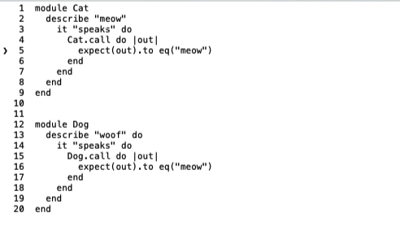

# DeadEnd

An error in your code forces you to stop. DeadEnd helps you find those errors to get you back on your way faster.

    DeadEnd: Unmatched `end` detected

    This code has an unmatched `end`. Ensure that all `end` lines
    in your code have a matching syntax keyword  (`def`,  `do`, etc.)
    and that you don't have any extra `end` lines.

    file: path/to/dog.rb
    simplified:

       3  class Dog
    ❯  5    defbark
    ❯  7    end
      12  end

## Installation in your codebase

To automatically annotate errors when they happen, add this to your Gemfile:

```ruby
gem 'dead_end'
```

And then execute:

    $ bundle install

If your application is not calling `Bundler.require` then you must manually add a require:

```ruby
require "dead_end"
```

If you're using rspec add this to your `.rspec` file:

```
--require dead_end
```

> This is needed because people can execute a single test file via `bundle exec rspec path/to/file_spec.rb` and if that file has a syntax error, it won't load `spec_helper.rb` to trigger any requires.

## Install the CLI

To get the CLI and manually search for syntax errors (but not automatically annotate them), you can manually install the gem:

    $ gem install dead_end

This gives you the CLI command `$ dead_end` for more info run `$ dead_end --help`.

## What syntax errors does it handle?

- Missing `end`:

```ruby
class Dog
  def bark
    puts "bark"

  def woof
    puts "woof"
  end
end
# => scratch.rb:8: syntax error, unexpected end-of-input, expecting `end'
```

- Unexpected `end`

```ruby
class Dog
  def speak
    @sounds.each |sound| # Note the missing `do` here
      puts sound
    end
  end
end
# => scratch.rb:7: syntax error, unexpected `end', expecting end-of-input
```

As well as unmatched `|` and unmatched `}`. These errors can be time consuming to debug because Ruby often only tells you the last line in the file. The command `ruby -wc path/to/file.rb` can narrow it down a little bit, but this library does a better job.

## What other errors does it handle?

In addition to syntax errors, the NoMethodError is annotated to show the line where the error occured, and the surrounding context:

```
scratch.rb:7:in `call': undefined method `upcase' for nil:NilClass (NoMethodError)


  1  class Pet
  6    def call
❯ 7      puts "Come here #{@neam.upcase}"
  8    end
  9  end
```

## Sounds cool, but why isn't this baked into Ruby directly?

I would love to get something like this directly in Ruby, but I first need to prove it's useful. The `did_you_mean` functionality started as a gem that was eventually adopted by a bunch of people and then Ruby core liked it enough that they included it in the source. The goal of this gem is to:

1. Get real world useage and feedback. If we gave you an awful suggestion, let us know! We try to handle lots of cases well, but maybe we could be better.
2. Prove out demand. If you like this idea, then vote for it by putting it in your Gemfile.

## Artificial Inteligence?

This library uses a goal-seeking algorithm for syntax error detection similar to that of a path-finding search. For more information [read the blog post about how it works under the hood](https://schneems.com/2020/12/01/squash-unexpectedend-errors-with-syntaxsearch/).

## How does it detect syntax error locations?

We know that source code that does not contain a syntax error can be parsed. We also know that code with a syntax error contains both valid code and invalid code. If you remove the invalid code, then we can programatically determine that the code we removed contained a syntax error. We can do this detection by generating small code blocks and searching for which blocks need to be removed to generate valid source code.

Since there can be multiple syntax errors in a document it's not good enough to check individual code blocks, we've got to check multiple at the same time. We will keep creating and adding new blocks to our search until we detect that our "frontier" (which contains all of our blocks) contains the syntax error. After this, we can stop our search and instead focus on filtering to find the smallest subset of blocks that contain the syntax error.

Here's an example:



## Development

After checking out the repo, run `bin/setup` to install dependencies. Then, run `rake spec` to run the tests. You can also run `bin/console` for an interactive prompt that will allow you to experiment.

To install this gem onto your local machine, run `bundle exec rake install`. To release a new version, update the version number in `version.rb`, and then run `bundle exec rake release`, which will create a git tag for the version, push git commits and tags, and push the `.gem` file to [rubygems.org](https://rubygems.org).

## Contributing

Bug reports and pull requests are welcome on GitHub at https://github.com/zombocom/dead_end. This project is intended to be a safe, welcoming space for collaboration, and contributors are expected to adhere to the [code of conduct](https://github.com/zombocom/dead_end/blob/master/CODE_OF_CONDUCT.md).


## License

The gem is available as open source under the terms of the [MIT License](https://opensource.org/licenses/MIT).

## Code of Conduct

Everyone interacting in the DeadEnd project's codebases, issue trackers, chat rooms and mailing lists is expected to follow the [code of conduct](https://github.com/zombocom/dead_end/blob/master/CODE_OF_CONDUCT.md).
